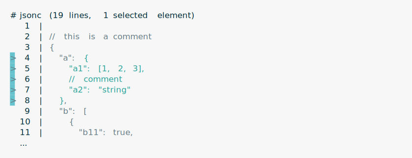
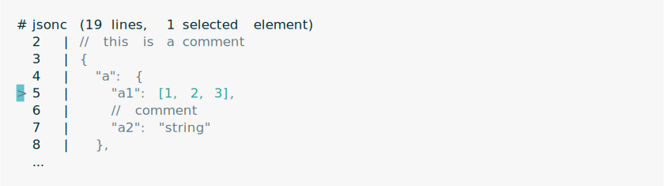
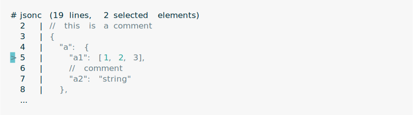
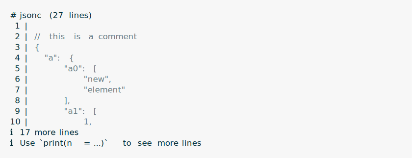
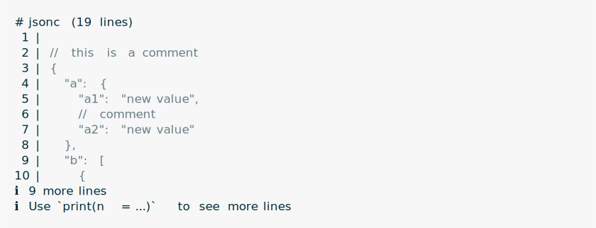
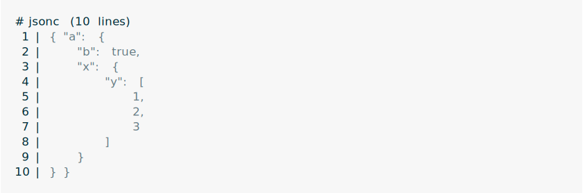

<!-- README.md is generated from README.Rmd. Please edit that file -->

# tsjsonc

<!-- badges: start -->


[](https://github.com/gaborcsardi/tsjsonc/actions/workflows/R-CMD-check.yaml)
<!-- badges: end -->

Extract and manipulate parts of JSON files without touching the
formatting and comments in other parts.

## Installation

You can install the development version of tsjsonc from
[GitHub](https://github.com/) with:

``` r
# install.packages("pak")
pak::pak("gaborcsardi/tsjsonc")
```

## Documentation

See at
[`https://gaborcsardi.github.io/tsjsonc/`](https://gaborcsardi.github.io/tsjsonc/reference/index.html/)
and also in the installed package: `help(package = "tsjsonc")`.

## Quickstart

### Create a tsjsonc object

Create a tsjsonc object from a string:

``` r
txt <- r"(
// this is a comment
{
  "a": {
    "a1": [1, 2, 3],
    // comment
    "a2": "string"
  },
  "b": [
    {
      "b11": true,
      "b12": false
    },
    {
      "b21": false,
      "b22": false
    }
  ]
}
)"
json <- ts_parse_jsonc(text = txt)
```

Pretty print a tsjsonc object:

``` r
json
```

<picture>
<source media="(prefers-color-scheme: dark)" srcset="man/figures/print-json-dark.svg">
 </picture>

### Select elements in a tsjsonc object

Select element by objects key:

``` r
ts_tree_select(json, "a")
```

<picture>
<source media="(prefers-color-scheme: dark)" srcset="man/figures/select-key-dark.svg">
 </picture>

Select element inside element:

``` r
ts_tree_select(json, "a", "a1")
```

<picture>
<source media="(prefers-color-scheme: dark)" srcset="man/figures/select-select-dark.svg">
 </picture>

Select element(s) of an array:

``` r
ts_tree_select(json, "a", "a1", 1:2)
```

<picture>
<source media="(prefers-color-scheme: dark)" srcset="man/figures/select-array-dark.svg">
 </picture>

Select multiple keys from an object:

``` r
ts_tree_select(json, "a", c("a1", "a2"))
```

<picture>
<source media="(prefers-color-scheme: dark)" srcset="man/figures/select-multiple-dark.svg">
 </picture>

Select nodes that match a tree-sitter query:

``` r
json |> ts_tree_select_query("((pair value: (false) @val))")
```

<picture>
<source media="(prefers-color-scheme: dark)" srcset="man/figures/select-query-dark.svg">
 </picture>

### Delete elements

Delete selected elements:

``` r
ts_tree_select(json, "a", "a1") |> ts_tree_delete()
```

<picture>
<source media="(prefers-color-scheme: dark)" srcset="man/figures/delete-dark.svg">
 </picture>

### Insert elements

Insert element into an array:

``` r
ts_tree_select(json, "a", "a1") |> ts_tree_insert(at = 2, "new")
```

<picture>
<source media="(prefers-color-scheme: dark)" srcset="man/figures/insert-array-dark.svg">
 </picture>

Inserting into an array reformats the array.

Insert element into an object, at the specified key:

``` r
ts_tree_select(json, "a") |>
  ts_tree_insert(key = "a0", at = 0, list("new", "element"))
```

<picture>
<source media="(prefers-color-scheme: dark)" srcset="man/figures/insert-object-dark.svg">
 </picture>

### Update elements

Update existing element:

``` r
ts_tree_select(json, "a", c("a1", "a2")) |> ts_tree_update("new value")
```

<picture>
<source media="(prefers-color-scheme: dark)" srcset="man/figures/update-dark.svg">
 </picture>

Inserts the element if some parents are missing:

``` r
json <- ts_parse_jsonc(text = "{ \"a\": { \"b\": true } }")
json
```

<picture>
<source media="(prefers-color-scheme: dark)" srcset="man/figures/update-insert-dark.svg">
 </picture>

``` r
ts_tree_select(json, "a", "x", "y") |> ts_tree_update(list(1,2,3))
```

<picture>
<source media="(prefers-color-scheme: dark)" srcset="man/figures/update-insert-2-dark.svg">
 </picture>

# License

MIT © Posit Software, PBC
